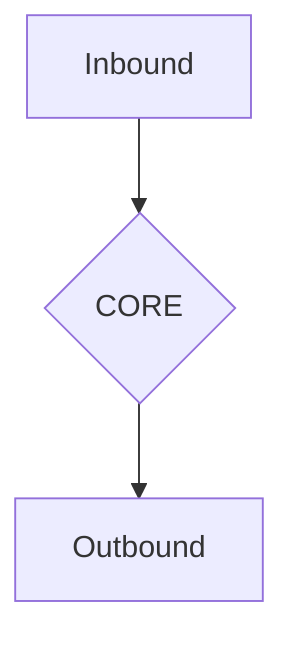
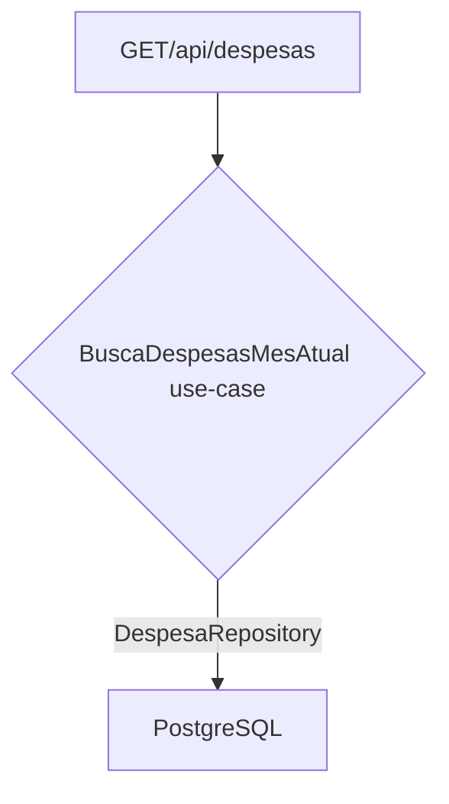

# Etapa Técnica - Muralis
#### obs: Avaliador, favor verificar erratas do desafio no final do README.md.
### URL da aplicação
- https://muralis-desafio-react.vercel.app/
- Utilizar a collection do Postman para testar a API: [Collection](https://github.com/pablowinck/muralis-desafio-nodejs/blob/main/REQUESTS_COLLECTION.json)


### Problema

Controlar os gastos de acordo com a renda disponível é fator fundamental para organização do Orçamento Doméstico, uma etapa importante nesse processo é manter um histórico detalhado de despesas, principalmente para os pequenos gastos diários. Nesse intuito você deve construir uma API REST que permita armazenar e exibir registros de despesas.

### Orientações Gerais

- Uma DESPESA deve possuir os seguintes dados: Valor, Descrição, Data, Tipo de Pagamento e Categoria;
- Os TIPOS DE PAGAMENTO são: Dinheiro, Débito, Crédito e Pix;
- A listagem de DESPESAS deve mostrar apenas os registros do mês vigente;
- Não será permitido utilização de ORMs;
- Mantenha uma separação adequada de responsabilidades;
- Utilize conceitos de Programação Orientada a Objetos quando achar pertinente;

### Endpoints
| Método | Endpoint      | Descrição         |
|--------|---------------|-------------------|
| GET    | /api/despesas | Listar despesas   |
| POST   | /api/despesas | Cadastrar despesa |

### Response Body
```json
{
  "data": null,
  "success": true
}
```
O valor do atributo **data** deve ser o resultado da **request** executada.
Para a função "Listar" deve conter a lista de despesas cadastradas no banco de dados. Para a função "Cadastrar" deve conter o ID da despesa recém inserida no banco de dados.

O atributo **success** será **true** caso a **request** seja executada com sucesso, caso contrário será **false**.

### Demandas
- Implementar os verbos http: POST, GET, PUT, DELETE, e PATCH;
- Retornar um **PDF** contendo as despesas, respeitando um intervalo de tempo;
- Retornar uma **lista** de despesas, respeitando a paginação;
- Retornar uma **Planilha Excel** contendo as despesas do mês vigente;
- Adicionar o endereço do estabelecimento onde a despesa aconteceu:
  - O usuário informar somente o CEP e o número do estabelecimento, os demais dados devem ser adquiridos através de um mecanismo externo, como o viacep.com.br, por exemplo.

### Modelo de dados:


### Arquitetura Hexagonal
A arquitetura hexagonal foi aplicada para separar a lógica de negócio da lógica de infraestrutura, permitindo assim, a troca de tecnologias sem afetar a lógica de negócio.


Exemplo de listagem de despesa:


### Deploy da aplicação
- A aplicação foi hospedada na plataforma Fly.io, utilizando o banco de dados PostgreSQL.
- Foi utilizado Github Actions para automatizar o deploy da aplicação.

### Tecnologias utilizadas
- **Express** - Framework web rapido e minimalista para Node.js
- **PostgreSQL** - Banco de dados relacional
- **AWS S3** - Armazenamento de arquivos
- **Jest** - Framework de testes
- **Eslint** - Linter
- **Prettier** - Formatação de código
- **ClassValidator** - Validação de dados
- **Morgan** - Logger
- **Pino** - Logger
- **Axios** - Cliente HTTP
- **PDFKit** - Biblioteca para geração de PDF
- **Json2CSV** - Biblioteca para geração de CSV

### Como rodar o projeto
* YARN
```bash
# Rode docker-compose para subir o banco de dados
$ docker-compose up -d

# Instale as dependências
$ yarn

# Rode a aplicação em dev-mode
$ yarn dev
```
* NPM
```bash
# Rode docker-compose para subir o banco de dados
$ docker-compose up -d

# Instale as dependências
$ npm install

# Rode a aplicação em dev-mode
$ npm run dev
```

### Erratas
- O usuário não deve informar somente o CEP e o número do estabelecimento. Pois há casos dois casos que aconteceria problemas críticos:
  - O CEP não retorna o endereço completo, como por exemplo o CEP 95800-000. Nesse caso, o usuário deverá informar o endereço completo.
  - Há casos que não se tem número no estabelecimento, nestes casos deveria poder preencher o campo complemento.
- Endpoints não batem com demandas, pois além dos verbos, não há os endpoints de geração de PDF e Excel.
- Modelo de dados não bate com demandas, pois não há endereço
